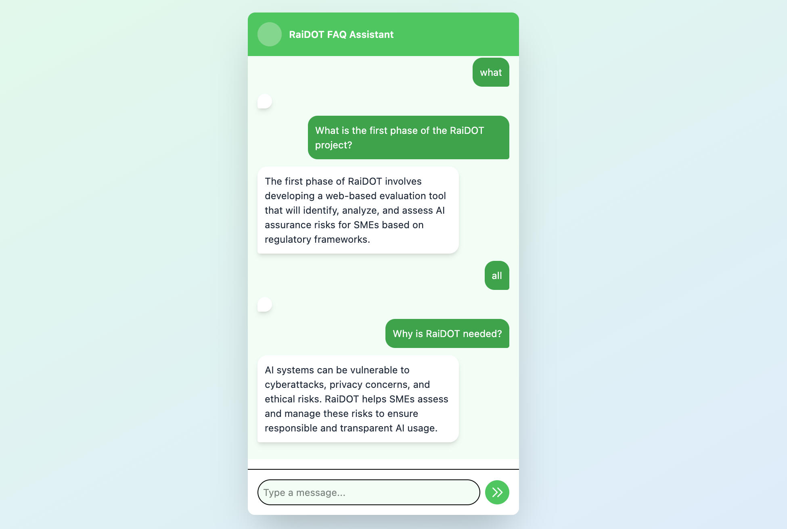

# RaiDOT Readme

## Overview

The FAQ Assistant is a web-based application designed to provide users with quick and efficient access to frequently asked questions (FAQs). It features a chat-like interface where users can search for FAQs, view all available FAQs, and interact with the system for instant responses. The application is built using **React** for the frontend and **FastAPI** for the backend, with FAQs stored in a JSON file (no database required due to the small dataset).

---

## Backend Approach

The backend is implemented using **FastAPI** and serves as the API layer for managing FAQs. Key features include:

1. **Data Storage**: FAQs are stored in a `faqs.json` file, which is loaded and saved using helper functions (`load_faqs` and `save_faqs`).
2. **Endpoints**:
   - `GET /faqs/`: Retrieves all FAQs.
   - `GET /faqs/{faq_id}`: Fetches a specific FAQ by its ID.
   - `GET /faqs/search/`: Searches FAQs based on a query string (matches both questions and answers).
3. **Startup Initialization**: Preloads a set of default FAQs into the JSON file if it is empty.
4. **CORS Middleware**: Configured to allow cross-origin requests for seamless frontend-backend communication.

---

## Frontend Approach

The frontend is built using **React** and provides a user-friendly chat interface. Key features include:

1. **Chat Interface**:
   - Users can type queries or commands (e.g., "all" to view all FAQs).
   - Messages are displayed in a conversational format, distinguishing between user and system responses.
2. **Search Functionality**:
   - Queries are sent to the backend to fetch matching FAQs.
   - If no results are found, the system displays all FAQs as a fallback.
3. **Dynamic FAQ Display**:
   - Search results are displayed interactively, allowing users to click on an FAQ to view its answer.

---

## Why No Database?

Given the limited and static nature of the FAQ data, a JSON file is sufficient for storage. This approach simplifies the architecture and avoids the overhead of setting up and managing a database.

---

## How It Works

1. **User Interaction**:
   - Users type a query or command in the chat input.
   - The input is sent to the backend via an API call.
2. **Backend Processing**:
   - The backend searches the JSON file for matching FAQs or retrieves all FAQs.
   - Results are returned to the frontend.
3. **Frontend Display**:
   - Results are displayed in the chat interface.
   - Users can interact with the results to view specific answers.

---

